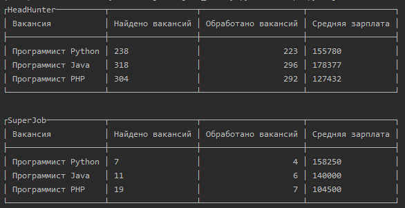

# Average salary

## Описание
Скрипт считает среднюю зарплату профессий:

* Программист Python
* Программист Java
* Программист PHP

Данные берутся из API сервисов [hh.ru](https://hh.ru/) и [superjob.ru](https://www.superjob.ru/).

## Требования к окружению
Разработка велась на python 3.7.3

## Как установить
Скачайте и установите зависимости из `requirements.txt`

    pip install requirements.txt

## Запуск
Если нужны данные по средней зарплате и с hh.ru и с superjob.ru, то придётся сначала получить
[Secret key](https://api.superjob.ru/) от superjob, т.к. без него данные будут недоступны.

Когда [Secret key](https://api.superjob.ru/) будет получен, можно запускать:

    pip install script.py -sj SECRET_KEY_FROM_SUPERJOB
 
Чтобы получить данные только из hh:

    pip install script.py